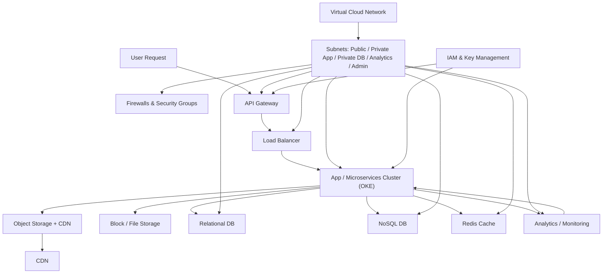

### Global Prime Video Platform Architecture on Oracle Cloud Infrastructure (OCI)

#### 🌐 Multi-Region & Multi-Language Overview

Prime Video delivers content globally in multiple languages (English, Telugu, Tamil, Hindi, Kannada, etc.), to millions of users. Key requirements:
- High availability and geo-distributed deployment.
- Support for media streaming, personalized recommendations, search, payments, security.
- Scalability for peak loads during live sports, premieres, and promotions.
- Regional data residency, legal compliance, and multi-language content.

All technical aspects below are mapped to OCI services with precise explanations and realistic scale/capacity estimates.

### 1. **Core Networking**

### 1.1 Virtual Cloud Network (**VCN**)

- **Role:** The foundational private network for all Prime Video resources in OCI.
- **Deployment:** One VCN per major region (e.g., North America, APAC, Europe, India, etc.).
- **CIDR Structure:** Example: 10.0.0.0/16 per VCN.
- **Connectivity:** VCN peering (for cross-region), site-to-site VPN (to on-prem), FastConnect for private connectivity.

#### **VCN Count Example**
| Region         | VCN Count  |
|----------------|------------|
| Americas       | 2          |
| Europe         | 2          |
| APAC           | 2          |
| India          | 1          |
| Africa         | 1          |
| Middle East    | 1          |
| **Total**      | **9**      |

### 1.2 **Subnets** & Zonal Design

- **Subnets:** Segment into public (load balancers, API gateways), private (app servers, DB), and restricted (admin, monitoring).
- **Zones:** Deploy resources in at least 2-3 availability domains per region for redundancy.

#### **Subnet Example (per region)**
- Public Subnets: 2 (production and edge/load balancer)
- Private Subnets: 3 (app, DB, analytics)
- Restricted/Admin: 1

### 1.3 **Firewalls & Network Security Groups (NSG)**

- **Purpose:** Micro-segmentation, zero-trust, and strict access controls.
- **Layers:** Use OCI Security Lists for subnet-level, NSGs for instance-level controls.
- **Examples:**
  - Apps communicate with DB only via specific NSG rules
  - API endpoints open only to Load Balancer

## 2. **Storage Architecture**

### 2.1 **Object Storage**

- **Use:** Store video content, images, subtitles, and backups.
- **Features:** Tiered (Standard/Archive), lifecycle rules, cross-region replication for disaster recovery.
- **Media Delivery:** Integrated with CDN for high-speed global streaming.

### 2.2 **Block Storage**

- **Use:** Attached to compute VMs (app servers, DB clusters) for primary data, logs, and transactional workloads.

### 2.3 **File Storage**

- **Use:** NFS-shared content for transcoding jobs, media pipelines, and team collaboration.

#### **Storage Estimate Chart**

| Content Type         | Daily Ingest | Total Storage Needed |
|----------------------|--------------|---------------------|
| Video (4K/HD/SD)     | 10 TB        | 5 PB+ (multi-year)  |
| Thumbnails/Subtitles | 1 TB         | 50 TB               |
| Log Files            | 250 GB       | 10 TB               |

## 3. **Database & Persistence**

### 3.1 **Relational Database (Autonomous/Exadata)**

- **Use:** User data, subscriptions, transactions, metadata, ratings.
- **Scale:** Multi-region Autonomous Database (PostgreSQL/Oracle flavor), cross-region sync for HA.
- **Feature:** OLTP optimized, encryption at rest/in transit, point-in-time recovery, auto-patching.
- **Count Example:** 1 RDBMS cluster per major region for geo-proximity.

### 3.2 **NoSQL Database**

- **Use:** Session management, catalogs, recommendations, watch history, real-time counters.
- **Option:** OCI NoSQL Database (for flexible schema), also supports global tables.
- **Feature:** Eventual consistency, low-latency, elastic scaling.

### 3.3 **Caching (Redis/KV Store)**

- **Use:** User session caching, trending content, fast personalization.
- **OCI Service:** Oracle Cloud Cache or Redis Cluster via Oracle Marketplace.

#### **Database and NoSQL Estimate**

| Purpose           | Technology              | Node Count (per region) | Notes                        |
|-------------------|------------------------|-------------------------|------------------------------|
| User DB           | Autonomous/Postgres     | 3 (Active/Active/HA)    | Master/read replicas         |
| Catalog/NoSQL     | OCI NoSQL Cluster      | 4+ shards               | Expand for catalog size      |
| Session Cache     | Redis Cache Cluster     | 2-4                     | For performance scaling      |
| Analytics         | Oracle Autonomous Data Warehouse | 2                | For ETL, dashboards         |

## 4. **Application Microservices & Internal Structure**

- **Service Deployment:** Each core function (Streaming, Recommendations, Search, Payments, Auth, Analytics) is a separate Kubernetes microservice, with language packs as dedicated deployments.
- **Pods:** Autoscale as per demand/region—e.g., 200-500 pods per region during high traffic.
- **Language Support:** Each service container supports localization (all required languages) using dynamic content loading from storage/NoSQL DB.

#### **Core Internal Microservices List**

| Service         | Example Pod/VM Count       | Key Backend                   |
|-----------------|---------------------------|-------------------------------|
| Media Streaming | 200-500                   | Object Store, CDN, Redis      |
| Recommendation  | 100-200                   | NoSQL, Data Warehouse         |
| Search          | 100-150                   | Elasticsearch, NoSQL          |
| Auth & Security | 50-100                    | RDBMS, NoSQL (sessions)       |
| Payments        | 50-100                    | RDBMS, KeyVault               |
| Analytics/ETL   | 20-50                     | Data Warehouse                |

## 5. **Network, Security, and Access Control**

### 5.1 **API Gateway & Load Balancers**

- **Role:** Distribute user traffic globally, support REST/gRPC/Websocket endpoints.
- **Deployed:** Edge subnets, integrated WAF (Web Application Firewall), bot detection.

### 5.2 **Service Mesh & Internal API Firewall**

- **Purpose:** Secure microservice-to-microservice calls, enforce policies, and monitor traffic.

### 5.3 **IAM/Key Management**

- **OCI Identity and Access Management:** Least privilege access, SSO integration.
- **Key Management Service:** Encryption keys for databases, application secrets.

## 6. **Analytics, Observability, and Cost Control**

### 6.1 **Analytics**

- **Data Pipeline:** Ingest logs/events (streaming), route to Autonomous Data Warehouse.
- **Real-Time KPIs:** Playback errors, regional traffic, language breakdowns, user retention.
- **Visualization:** Embedded dashboards (Oracle Analytics Cloud).

### 6.2 **Monitoring/Observability**

- **Tools:** OCI Monitoring (metrics, alerting), distributed tracing (Jaeger, Zipkin).
- **SLAs:** Uptime >99.99%, automatic failover, proactive alerting.

### 6.3 **Cost Optimization**

- **Autoscaling:** HPA for Kubernetes pods, compute scale up/down per region.
- **Budget Controls:** OCI Budgets and alerts on resource consumption.

## 7. **Sample Infrastructure Estimation Table**

| Resource / Service     | Per Major Region      | Global Scale (6 Regions)   |
|------------------------|----------------------|---------------------------|
| VCNs                   | 1                    | 6+                        |
| Subnets                | 6                    | 36+                       |
| Load Balancers         | 4                    | 24+                       |
| RDBMS Clusters         | 1                    | 6                         |
| NoSQL Clusters         | 2                    | 12                        |
| Cache Clusters         | 2                    | 12                        |
| Analytics Warehouse    | 1                    | 6                         |
| Object Storage (TB)    | 1,000+               | 6,000+                    |
| Application Pods       | 500–1,000            | 6,000+                    |
| Monitoring Integrations| 10+                  | 60+                       |

## 8. **Internal Functionality Workflow Illustrations**

*(Descriptions for diagrams to include visually in Word)*

- **User Request Flow:** User→Global Load Balancer→Regional API Gateway→Language Service→Auth→Streaming Microservice→Object Storage/CDN→Client.
- **Media Pipeline:** Ingest video→Transcode service→Store in Object Storage→Publish to all regions→Distribute via CDN.
- **Analytics/ETL:** Streaming logs→Event Bus→Data Warehouse→Reports/Dashboards.

# **Key Takeaways**

- Deploy **separate VCNs and subnets** in each global region for secure, high-availability operations.
- Use **object storage and CDN integration** for efficient, geo-replicated media delivery.
- Leverage **database and NoSQL clusters** for user, content, session, and analytics data, scaling per region.
- Implement **firewall, security lists, and IAM** for defense-in-depth.
- Monitor all metrics and manage spend using built-in analytics and budgeting.

graph TD
  User[User Request]
  VCN["Virtual Cloud Network"]
  Subnets["Subnets: Public / Private App / Private DB / Analytics / Admin"]
  Firewall["Firewalls & Security Groups"]
  API["API Gateway"]
  LB["Load Balancer"]
  App["App / Microservices Cluster (OKE)"]
  ObjectStore["Object Storage + CDN"]
  Block["Block / File Storage"]
  RDBMS["Relational DB"]
  NoSQL["NoSQL DB"]
  Cache["Redis Cache"]
  Analytics["Analytics / Monitoring"]
  IAM["IAM & Key Management"]
  CDN["CDN"]

  User --> API
  API --> LB
  LB --> App
  App --> ObjectStore
  App --> Block
  App --> RDBMS
  App --> NoSQL
  App --> Cache
  App --> Analytics

  VCN --> Subnets
  Subnets --> API
  Subnets --> LB
  Subnets --> App
  Subnets --> RDBMS
  Subnets --> NoSQL
  Subnets --> Cache
  Subnets --> Analytics
  Subnets --> Firewall

  IAM --> App
  IAM --> API

  ObjectStore --> CDN
  Analytics --> App

